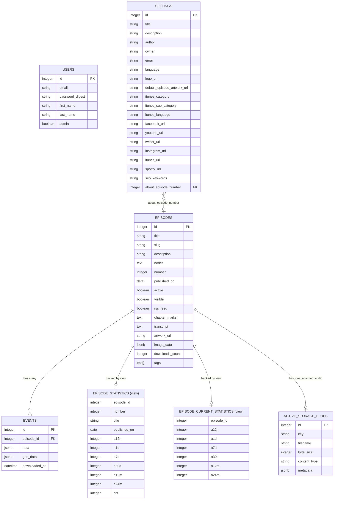
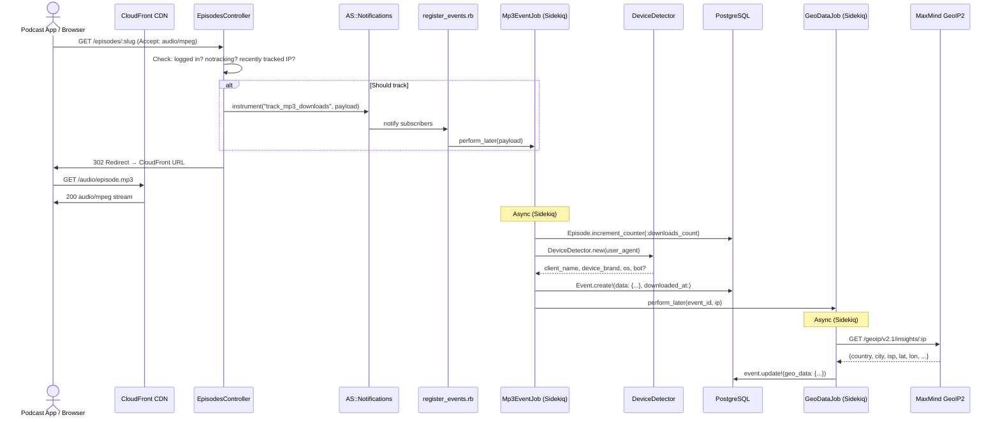
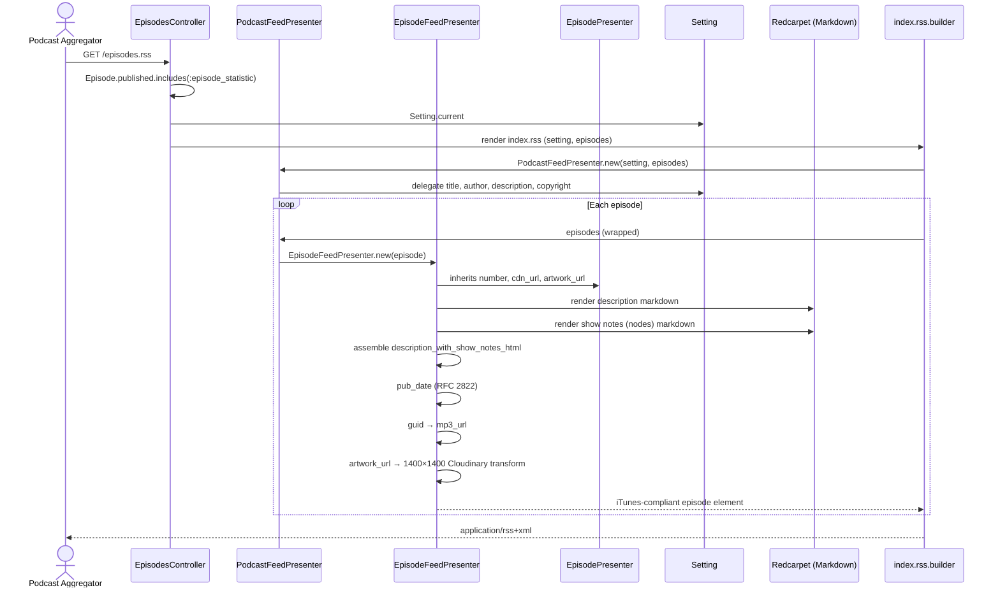
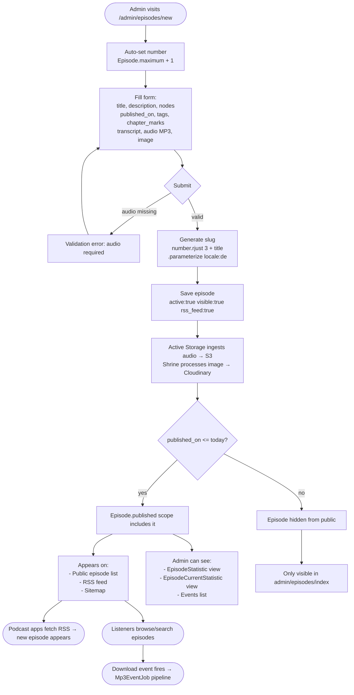
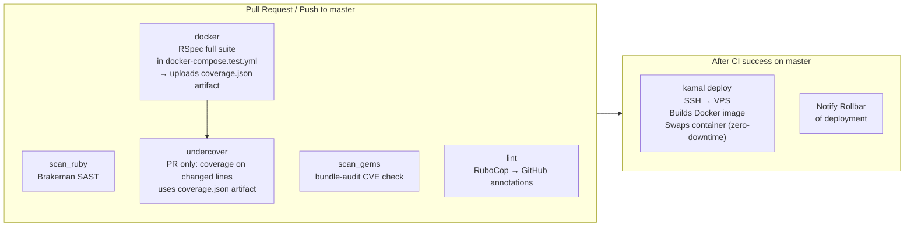

# Podi — System Overview

**Podi** is a self-hosted podcast publishing platform built on Rails 8.1. It covers the full lifecycle of a podcast: episode management with audio/image uploads, RSS feed generation for podcast directories, per-download analytics with device detection and geolocation, and a simple admin interface. A single-operator setup — one podcast, one admin.

---

## Table of Contents

1. [Core Analysis](#core-analysis)
   - [Technology Stack](#technology-stack)
   - [Design Patterns](#design-patterns)
   - [Data Models](#data-models)
   - [Architecture Diagram](#architecture-diagram)
2. [System Design](#system-design)
   - [File Map & Relationships](#file-map--relationships)
   - [Data Flow: Episode Download Tracking](#data-flow-episode-download-tracking)
   - [Data Flow: RSS Feed Generation](#data-flow-rss-feed-generation)
   - [Admin Episode Lifecycle](#admin-episode-lifecycle)
3. [Legacy Assessment](#legacy-assessment)

---

## Core Analysis

### Technology Stack

| Layer | Technology | Notes |
|---|---|---|
| **Framework** | Rails 8.1 | Full-stack, hotwire-first |
| **Database** | PostgreSQL 17 | JSONB, native arrays, DB views |
| **Background Jobs** | Sidekiq 7 + Redis | Async download processing |
| **File Storage** | Shrine + Cloudinary (images), Active Storage + S3/CloudFront (audio) | Two separate upload stacks |
| **Frontend** | Hotwire (Turbo + Stimulus), Bootstrap 5.3, HAML | No client-side framework |
| **Authentication** | Custom session-based auth (`has_secure_password`) | Migrated away from Devise (Nov 2025) |
| **HTTP Serving** | Puma + Thruster | Thruster provides HTTP caching layer |
| **Deployment** | Docker + Kamal | VPS at 37.120.190.122 |
| **Error Tracking** | Rollbar | Notified on deploy |
| **Performance Monitoring** | NewRelic RPM | Custom parameters per request |
| **Security Scanning** | Brakeman (SAST) + Bundler-audit | Run in CI |
| **Geolocation** | MaxMind GeoIP2 API | Async after download event |
| **Device Detection** | DeviceDetector gem | UA parsing in `Mp3EventJob` |
| **Statistics** | PostgreSQL views (Scenic gem) | Two materialized view models |
| **Podcast Player** | Podlove Web Player | Config built via service object |
| **Markdown** | Redcarpet | Descriptions, show notes, RSS text |
| **Rate Limiting** | Rack::Attack | Applied at middleware level |
| **Test Suite** | RSpec, Capybara, Selenium | System tests with Chrome |
| **Coverage** | SimpleCov + Undercover | Per-line coverage on changed code in PRs |
| **Linting** | RuboCop Omakase, Haml-lint | GitHub annotations in CI |

### Design Patterns

**Service Objects** — business logic extracted to `app/services/`:
- `ConvertChapters`, `ConvertChaptersToText` — parse chapter mark strings
- `ParseVtt` — parse WebVTT transcript files
- `FetchGeoData` — HTTP call to MaxMind GeoIP2
- `PodloveWebplayerConfigBuilder` — build JSON for the audio player UI
- All inherit from `BaseService` (includes `ActiveModel::Model`, `self.call` factory method)

**Presenter / Decorator** — view formatting via `SimpleDelegator` in `app/presenters/`:
- `EpisodePresenter` — URL generation, padded number, formatted durations
- `EpisodeFeedPresenter` — extends EpisodePresenter with iTunes-specific formatting
- `PodcastFeedPresenter` — wraps a collection with `EpisodeFeedPresenter`
- `StatisticPresenter` — zero → dash formatting for download stats table
- `EventPresenter` — formats JSONB download event data for the admin UI

**Notification-based Job Dispatch** — `EpisodesController#show` publishes an `ActiveSupport::Notifications` event (`"track_mp3_downloads"`). An initializer subscribes and enqueues `Mp3EventJob`, decoupling the controller from job dispatch.

**Database Views (Scenic)** — Two read-only models (`EpisodeStatistic`, `EpisodeCurrentStatistic`) backed by PostgreSQL views, used exclusively for analytics. The views compute download counts at multiple time-window aggregates entirely in SQL.

**Singleton Settings** — `Setting.current` provides global podcast configuration (metadata, social URLs, iTunes config). Enforced at the Ruby layer — no DB uniqueness constraint; convention is one record.

### Data Models



### Architecture Diagram

```mermaid
graph TB
    subgraph Client["Client (Browser)"]
        Browser["Browser / Podcast App"]
        PodcastApp["Podcast App\n(Apple, Spotify, etc.)"]
    end

    subgraph Rails["Rails Application (Puma + Thruster)"]
        Router["config/routes.rb"]

        subgraph Public["Public Controllers"]
            WC["WelcomeController\n(home, about, imprint)"]
            EC["EpisodesController\n(index, show, search)"]
            FC["RSS Feed\n(episodes.rss)"]
            SC["SitemapsController"]
        end

        subgraph Admin["Admin Controllers (auth required)"]
            AEC["Admin::EpisodesController"]
            ASC["Admin::StatisticsController"]
            ASetC["Admin::SettingsController"]
            AEvC["Admin::EventsController"]
        end

        subgraph Auth["Authentication"]
            USC["Users::SessionsController"]
            AppC["ApplicationController\n(current_user, authorize_admin)"]
        end

        subgraph Services["Services (app/services/)"]
            PCC["PodloveWebplayerConfigBuilder"]
            FGD["FetchGeoData"]
            CC["ConvertChapters"]
            PV["ParseVtt"]
        end

        subgraph Presenters["Presenters (app/presenters/)"]
            EP["EpisodePresenter"]
            EFP["EpisodeFeedPresenter"]
            PFP["PodcastFeedPresenter"]
            StP["StatisticPresenter"]
            EvP["EventPresenter"]
        end

        subgraph Models["Models (app/models/)"]
            EM["Episode"]
            EvM["Event"]
            UM["User"]
            SM["Setting"]
            ESt["EpisodeStatistic (view)"]
            ECSt["EpisodeCurrentStatistic (view)"]
        end

        subgraph Jobs["Background Jobs (Sidekiq)"]
            MEJ["Mp3EventJob\n(UA parsing, Event creation)"]
            GDJ["GeoDataJob\n(IP geolocation)"]
        end

        subgraph Notifications["ActiveSupport::Notifications"]
            TE["track_mp3_downloads"]
        end
    end

    subgraph Storage["External Storage"]
        S3["AWS S3\n(audio files)"]
        CF["CloudFront CDN\n(audio delivery)"]
        CL["Cloudinary\n(episode artwork)"]
    end

    subgraph ExternalAPIs["External APIs"]
        MM["MaxMind GeoIP2\n(geolocation)"]
    end

    subgraph Infrastructure["Infrastructure"]
        PG["PostgreSQL 17\n(data + views)"]
        RD["Redis\n(Sidekiq queue)"]
        RB["Rollbar\n(error tracking)"]
        NR["NewRelic\n(performance)"]
    end

    Browser -->|"HTTP request"| Router
    PodcastApp -->|"RSS/MP3"| Router

    Router --> Public
    Router --> Admin
    Router --> Auth

    EC -->|"publishes event on MP3 download"| TE
    TE -->|"async enqueue"| MEJ
    MEJ -->|"enqueue"| GDJ
    GDJ --> FGD
    FGD -->|"HTTP"| MM

    EC --> PCC
    FC --> PFP
    PFP --> EFP
    EC --> EP
    AEC --> EP
    ASC --> StP
    AEvC --> EvP

    Models --> PG
    ESt --> PG
    ECSt --> PG
    Jobs --> PG
    Jobs --> RD

    EM -->|"image_data"| CL
    EM -->|"audio attachment"| S3
    EC -->|"redirect to"| CF

    Rails -->|"errors"| RB
    Rails -->|"metrics"| NR
```



---

## System Design

### File Map & Relationships

#### Entry Points & Routing

```
config/routes.rb
  ├── root → WelcomeController#index
  ├── /episodes → EpisodesController (index, show, search)
  ├── /episodes/:slug → EpisodesController#show
  │     └── on MP3 download: publishes notification → Mp3EventJob
  ├── /:number → WelcomeController#epsiode (redirect shortcut, e.g. /006)
  ├── /login, /logout → Users::SessionsController
  ├── /admin → Admin namespace (all require admin session)
  │     ├── /admin/episodes → Admin::EpisodesController
  │     ├── /admin/statistics → Admin::StatisticsController
  │     ├── /admin/settings → Admin::SettingsController
  │     ├── /admin/events → Admin::EventsController
  │     └── /sidekiq → Sidekiq Web UI (admin only, rack mount)
  ├── /sitemap.xml → SitemapsController
  └── /robots.txt → RobotsController
```

#### Authentication Flow

```
app/controllers/application_controller.rb
  ├── current_user         → session[:user_id] lookup via User.find_by
  ├── authenticate_user!   → redirect to /login if no session
  └── authorize_admin      → redirect to / if !current_user.admin?

app/controllers/admin/base_controller.rb
  └── before_action :authorize_admin  (all admin controllers inherit this)

app/controllers/users/sessions_controller.rb
  ├── new   → renders login form
  ├── create → User.authenticate_by(email:, password:) → sets session[:user_id]
  └── destroy → resets session
```

#### Episode Model & Attachments

```
app/models/episode.rb
  ├── has_one_attached :audio            → Active Storage → S3
  ├── include ImageUploader::Attachment(:image)  → Shrine → Cloudinary
  ├── has_one :episode_statistic         → read-only DB view
  ├── has_one :episode_current_statistic → read-only DB view
  ├── scope :published                   → visible + active + published_on <= today
  ├── scope :search(query)               → ILIKE on title, description, tags
  └── tag_list / tag_list=               → converts PostgreSQL text[] ↔ CSV string

app/uploaders/image_uploader.rb
  └── validates MIME: image/jpeg, image/png, image/webp

config/initializers/shrine.rb
  ├── test:       Shrine::Storage::Memory
  └── production: Shrine::Storage::Cloudinary (prefixed by env)
```

#### Download Tracking Pipeline

```
app/controllers/episodes_controller.rb#show
  └── ActiveSupport::Notifications.instrument("track_mp3_downloads", payload)
         payload: { episode_id, ip, user_agent, ... }

config/initializers/register_events.rb
  └── .subscribe("track_mp3_downloads") → Mp3EventJob.perform_later(payload)

app/jobs/mp3_event_job.rb
  ├── Episode.increment_counter(:downloads_count, episode_id)
  ├── DeviceDetector.new(user_agent) → client_name, device_brand, os_name, ...
  ├── Event.create!(episode_id:, data: {...}, downloaded_at:)
  └── GeoDataJob.perform_later(event.id, ip)

app/jobs/geo_data_job.rb
  └── FetchGeoData.call(ip) → event.update!(geo_data: {...})

app/services/fetch_geo_data.rb
  └── HTTP GET MaxMind GeoIP2 API → { country, city, isp, lat, lon, ... }
```

#### Statistics Layer

```
db/views/episode_statistics_v*.sql
  └── Aggregates Events.downloaded_at per episode
      Groups: since_publication, last 12h, 1d, 3d, 7d, 14d, 30d, 60d, 3m, 6m, 12m, 18m, 24m

db/views/episode_current_statistics_v*.sql
  └── Same aggregation, scoped to recent windows (last 24h to 2 years)

app/models/episode_statistic.rb          (read-only, belongs_to :episode)
app/models/episode_current_statistic.rb  (read-only, belongs_to :episode)

app/controllers/admin/statistics_controller.rb
  └── Queries both views, supports configurable column-based sorting

app/presenters/statistic_presenter.rb
  └── Formats zeros as "-" for admin statistics table
```

#### RSS Feed

```
app/controllers/episodes_controller.rb#index (format: :rss)
  └── @episodes = Episode.published.includes(:episode_statistic)

app/views/episodes/index.rss.builder
  └── PodcastFeedPresenter.new(setting, episodes)
        └── EpisodeFeedPresenter.new(episode) per item
              ├── guid          → mp3_url (episode download URL)
              ├── pub_date      → RFC 2822
              ├── artwork_url   → 1400×1400 (iTunes requirement)
              ├── description   → rendered markdown + chapters + show notes + CTA
              └── enclosure     → CDN URL, MIME type, byte_size
```

#### Admin Episode CRUD

```
app/controllers/admin/episodes_controller.rb
  ├── new    → auto-increments Episode.maximum(:number)
  ├── create → generates slug: "#{number.rjust(3,'0')} #{title}".parameterize(locale: :de)
  └── update → regenerates slug on save

app/views/admin/episodes/
  ├── _form.html.haml  → audio upload (Active Storage), image upload (Shrine),
  │                       chapter_marks, transcript, tags, published_on, number
  └── show/index/edit  → standard CRUD views

app/presenters/episode_presenter.rb
  ├── number          → "001", "042" (left-padded)
  ├── cdn_url         → CloudFront URL if CLOUDFRONT_URL set, else S3
  ├── mp3_url         → episode show path with notracking param if needed
  ├── artwork_url     → Cloudinary responsive URL or Setting default
  └── duration_formatted → "1:23:45"
```

#### Frontend Interactivity

```
app/javascript/application.js
  ├── import "@hotwired/turbo-rails"
  ├── import "bootstrap"
  ├── SearchController      → app/javascript/controllers/search_controller.js
  └── InfiniteScrollController → app/javascript/controllers/infinite_scroll_controller.js

SearchController
  └── debounced (300ms) form submission on keyup → Turbo frame update

InfiniteScrollController
  └── IntersectionObserver on sentinel element
        └── fetch(data-url) → append HTML → move sentinel to new next-page URL
```

---

### Data Flow: Episode Download Tracking



---

### Data Flow: RSS Feed Generation



---

### Admin Episode Lifecycle



---

### CI/CD Pipeline



---

## Legacy Assessment

### Architectural Inconsistencies

**Two separate file upload stacks running in parallel.**
Images use Shrine + Cloudinary (`image_data` JSONB column, `ImageUploader`). Audio uses Rails Active Storage + S3. This likely reflects different implementation phases — Shrine was in place first, Active Storage added later for audio. Both work, but new developers must learn two upload APIs. `EpisodePresenter#cdn_url` bridges them at presentation time.

**Typo in route/controller method name that has become permanent.**
`WelcomeController#epsiode` (missing 't') handles numeric episode shortcuts (e.g., `/006`). The method name is wrong but the route works and changing it would require routing updates. Not harmful, but a stumbling block for anyone reading the routes file.

**`Setting.current` raises if no record exists.**
The singleton pattern returns the last record by `created_at`. There is no `first_or_create`, no DB uniqueness constraint, and no nil guard. Bootstrapping a fresh environment without a seed will raise a `NoMethodError` on the `nil` return if the rescue isn't in place. The production app works because a setting record always exists, but this is invisible to a new developer.

**Slug locale hardcoded in controller.**
`Admin::EpisodesController` generates slugs with `.parameterize(locale: :de)`. This is fine for a German podcast, but it's buried in the controller rather than being a model concern. If the locale changes or the episode is renamed, the slug changes.

### Deviations from Rails Best Practices

**Slug generation lives in the controller, not the model.**
`admin/episodes_controller.rb` assembles the slug with `"#{number.rjust(3, '0')} #{title}".parameterize(locale: :de)`. Rails convention (and the project's own architecture rules) would put this in a `before_save` callback or a model method. The controller has to call this explicitly on both `create` and `update`.

**`EpisodeStatistic` and `EpisodeCurrentStatistic` are loaded with `Episode.includes`** in the statistics controller but the relationship is `has_one`. Eager loading a `has_one` backed by a view works, but Scenic view models don't support `joins` in the same way — the current approach loads all statistics which is fine at this scale but could become a query concern with many episodes.

**`ApplicationController#current_setting` is memoized with `||=`** — this is correct for a reference that never changes in a request, but the memoization means that if `Setting` has no record (fresh environment), the `nil` is cached for the request lifetime, causing confusing cascading errors.

**Download deduplication is IP + 2-minute window, stored in Rails cache.** There is no explicit cache backend configured for development — it defaults to memory store, which resets on each restart. This means the deduplication logic behaves differently in development vs production (where Redis or another persistent cache should be configured).

### Old vs New Architectural Approaches

**Devise → Custom Auth (November 2025).** The migration removed Devise and replaced it with Rails 8 `has_secure_password` + a hand-rolled sessions controller. The new approach is simpler and removes the dependency. Remnants to watch: any views or mailers that referenced Devise helpers (e.g., `devise_error_messages!`) should have been cleaned up.

**Solid Queue & Solid Cache were added then removed.** Both gems appear in recent migration history as temporary experiments. The project returned to Sidekiq + Redis for jobs and appears to use no persistent cache store in production (Thruster provides HTTP caching at the reverse proxy layer). This is a valid simplification for a single-operator app.

**Statistics via Scenic DB views vs application-layer aggregation.** The SQL view approach is the correct call here — all aggregations happen in the DB with no N+1 risk and no Ruby code to maintain per-window. New windows require adding a column to the view SQL and migrating; this is a maintenance trade-off that pays off at read time.

**Two Gemfile groups indicate the Solid Queue era:** references to `solid_queue` and `solid_cable` may linger in comments or config. The current job infrastructure is unambiguously Sidekiq.

---

*Generated from codebase analysis. Last updated: 2026-04-08.*
